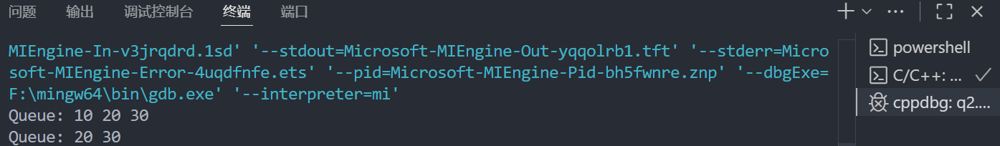
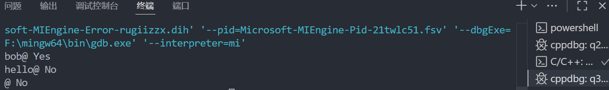
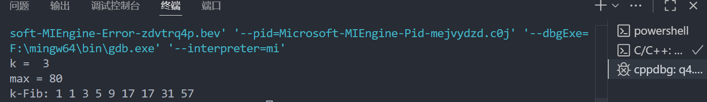

10月11日作业： 1、按照教材示例，写出hanoi（3,a,b,c）递归调用的递归工作栈变化过程； 3.28 3.31 3.32（注意此题约束条件为：循环队列的容量仅为k）

10月15日作业： 4.18（注意，采用教科书4.2.1中定长顺序存储表示，且不允许调用串的基本操作） 4.22 （应尽可能避免移动操作）

# 数据结构作业 第四周

<center>
    霍斌 PB24111627
</center>

## 3.28
由题意实现了一个循环队列的头文件CircularQueue.h，包含初始化、出队、入队算法，并提供了q2.cpp以供测试:
```c
#ifndef CIRCULARQUEUE_H
#define CIRCULARQUEUE_H

#include <stdio.h>
#include <stdlib.h>
#include <iostream>

typedef struct QueueNode {
    int data;
    struct QueueNode* next;
} QueueNode;

typedef struct CircularQueue {
    QueueNode* dummyHead;
    QueueNode* tail;
    int size;
} CircularQueue;

// 初始化循环队列
void initQueue(CircularQueue* queue) {
    queue->dummyHead = (QueueNode*)malloc(sizeof(QueueNode));
    // 让dummyHead->next 指向自身
    queue->dummyHead->next = queue->dummyHead;
    queue->tail = queue->dummyHead;
    queue->size = 0;
}

// 入队操作
void enqueue(CircularQueue* queue, int value) {
    // 创建新的节点
    QueueNode* newNode = (QueueNode*)malloc(sizeof(QueueNode));
    newNode->data = value;

    // 将新节点插入到 tail 之后
    newNode->next = queue->dummyHead;

    if (queue->size == 0) {
        queue->dummyHead->next = newNode;
        queue->tail = newNode;
    } else {
        queue->tail->next = newNode;
        queue->tail = newNode;
    }

    queue->size++; // 更新队列的大小
}

// 出队操作
void dequeue(CircularQueue* queue) {
    // 检测队列为空的情况
    if (queue->size == 0) {
        std::cout << "Queue is empty." << std::endl;
        return;
    }

    QueueNode* toDeleteNode = queue->dummyHead->next;
    queue->dummyHead->next = toDeleteNode->next;
    free(toDeleteNode);
    queue->size--;

    // 如果出队后队列为空，恢复到空队列初始状态
    if (queue->size == 0) {
        queue->tail = queue->dummyHead;
        queue->dummyHead->next = queue->dummyHead;
    }
}

// 销毁队列
void destroyQueue(CircularQueue* queue) {
    // 销毁所有节点
    while (queue->size > 0) {
        dequeue(queue);
    }
    // 释放dummyHead节点
    free(queue->dummyHead);
    queue->dummyHead = NULL;
    queue->tail = NULL;
    queue->size = 0;
}

void printQueue(CircularQueue* queue) {
    QueueNode* current = queue->dummyHead->next;
    std::cout << "Queue: ";
    for (int i = 0; i < queue->size; i++) {
        std::cout << current->data << " ";
        current = current->next;
    }
    std::cout << std::endl;
}
#endif // CIRCULARQUEUE_H
```
```cpp
#include "CircularQueue.h"

int main() {
    CircularQueue queue;
    initQueue(&queue);

    enqueue(&queue, 10);
    enqueue(&queue, 20);
    enqueue(&queue, 30);
    printQueue(&queue);

    dequeue(&queue);
    printQueue(&queue);

    destroyQueue(&queue);

    return 0;
}
```
测试结果如下:

## 3.31
使用双指针法判断字符串是否回文，而且会排除空字符串课空指针的情况.
```cpp
// 判断以@为结束符的字符串是否回文
#include <iostream>
#include <cstring>

bool isPalindrome(const char* str) {
    if(str == nullptr || strlen(str) == 1) {
        return false; // 空指针或者空字符串不是回文
    }

    // 左右双指针法
    int left = 0;
    int right = strlen(str) - 2; // -2是为了跳过结尾的@符号

    // 比较左右两端的字符，逐渐向中间靠拢
    while(left < right) {
        if(str[left] != str[right]) {
            return false; // 发现不匹配直接返回false
        }
        left++;
        right--;
    }

    // 未发现不匹配的字符，说明是回文
    return true;
}

int main() {
    const char* testStr1 = "bob@";
    const char* testStr2 = "hello@";
    const char* testStr3 = "@";

    // 测试回文函数
    std::cout << testStr1 << " " << (isPalindrome(testStr1) ? "Yes" : "No") << std::endl;
    std::cout << testStr2 << " " << (isPalindrome(testStr2) ? "Yes" : "No") << std::endl;
    std::cout << testStr3 << " " << (isPalindrome(testStr3) ? "Yes" : "No") << std::endl;

    return 0;
}
```
函数测试结果:

## 3.32
使用上文中的CircularQueue.h解决问题.
```cpp
#include "CircularQueue.h"
#include <iostream>
using namespace std;

int main() {
	int k, max;
	cout << "k =  ";
	cin >> k;
	cout << "max = ";
	cin >> max;

	CircularQueue queue;
	initQueue(&queue);

	// 将前k项入队，均为1
	for (int i = 0; i < k; ++i) {
		enqueue(&queue, 1);
	}

    std::cout << "k-Fib: ";
	int fn = 1; // 队尾项
	while (true) {
		// 计算下一项
		int sum = 0;
		QueueNode* cur = queue.dummyHead->next;
		for (int i = 0; i < k; ++i) {
			sum += cur->data;
			cur = cur->next;
		}
		// sum为f_{n+1}
		if (fn <= max && sum > max) {
			break;
		}
		// 队列弹出最早的，加入新项
		dequeue(&queue);
        // dequeue之前输出队首的值，表示出整个数列
        cout << queue.dummyHead->next->data << ' ';
		enqueue(&queue, sum);
		fn = sum;
	}

	// 输出循环队列中的k项
	QueueNode* cur = queue.dummyHead->next;
	for (int i = 0; i < k; ++i) {
		cout << cur->data << " ";
		cur = cur->next;
	}
	cout << endl;

	destroyQueue(&queue);
	return 0;
}
```
测试结果:

## 4.18

## 4.22