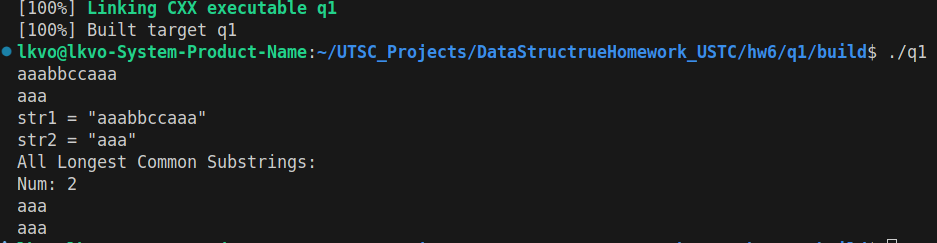
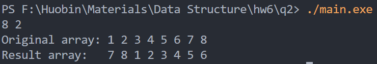
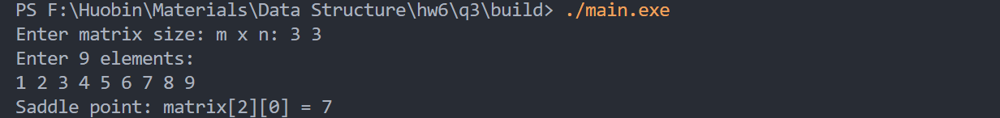

# 数据结构作业 第七周
<center>
    霍斌 PB24111627
</center>

## q1 4.31
寻找两个字符串中所有的公共最长子串，使用动态规划求解:
```cpp
#include <iostream>
#include <vector>
#include <string>
#include <set>
#include <algorithm>

using namespace std;

// 定长顺序表表示的字符串s和t，求s和t中的所有最长公共子串

// 寻找所有最长公共子串
vector<string> findLongestCommonSubstrings(const string& str1, const string& str2) {
    int m = str1.length();
    int n = str2.length();
    
    // dp[i][j]表示str1前i个字符和str2前j个字符的最长公共子串长度
    vector<vector<int>> dp(m + 1, vector<int>(n + 1, 0));
    
    int max = 0;  // 最长公共子串的长度
    set<string> result; // 使用set避免重复
    
    for (int i = 1; i <= m; i++) {
        for (int j = 1; j <= n; j++) {
            if (str1[i-1] == str2[j-1]) {
                // 如果发现有新的匹配字符，就加一
                dp[i][j] = dp[i-1][j-1] + 1;

                // 判断dp[i][j]是否最长，如果最长的话就更新max和结果集
                if (dp[i][j] > max) {
                    max = dp[i][j];
                    result.clear();
                    result.insert(str1.substr(i - max, max));
                }
                // 如果发现长度等于最大长度，说明发现了多个公共最长子串
                else if (dp[i][j] == max && max > 0) {
                    result.insert(str1.substr(i - max, max));
                }
            } else {
                dp[i][j] = 0;
            }
        }
    }
    
    return vector<string>(result.begin(), result.end());
}

int main() {
    // 输入两个字符串测试
    string str1, str2;
    cin >> str1 >> str2;
    cout << "str1 = \"" << str1 << "\"\n";
    cout << "str2 = \"" << str2 << "\"\n";

    vector<string> longestCommonSubstrings = findLongestCommonSubstrings(str1, str2);
    cout << "All Longest Common Substrings:\n";
    for (int i = 0; i < longestCommonSubstrings.size(); i++) {
        cout << longestCommonSubstrings[i] << "\n";
    }
    
    return 0;
}
```
设置str1和str2验证得到结果如下图所示:

时间复杂度是$O(mn)$, 因为需要遍历这个$m*n$的dp表.
## q2 5.18
先翻转整个数组，然后分别翻转前k的部分后后n-k的部分即可:
```cpp
#include <iostream>

// 只使用一个temp的空间.
int temp;

void printArr(int arr[], int n) {
    for(int i = 0; i < n; i++) {
        std::cout << arr[i] << " ";
    }
    std::cout << std::endl;
}

// 翻转数组arr从index left到right的元素
void reverse(int arr[], int left, int right) {
    while(left < right) {
        temp = arr[left];
        arr[left] = arr[right];
        arr[right] = temp;
        left++;
        right--;
    }
}

// 将数组arr[0..n-1]循环右移k个位置（只用一个元素的额外空间）
int main() {
    int n, k;
    std::cin >> n >> k;
    int arr[n];

    for(int i = 0; i < n; i++) {
        arr[i] = i + 1;
    }

    k = k % n; // 防止 k > n

    std::cout << "Original array: ";
    printArr(arr, n);

    reverse(arr, 0, n-1);
    reverse(arr, 0, k-1);
    reverse(arr, k, n-1);

    std::cout << "Result array:   ";
    printArr(arr, n);
    return 0;
}
```
结果如下:

## q3 5.19
直接使用遍历的方法:
```cpp
#include <iostream>
#include <vector>

using namespace std;

// 找出所有鞍点

void findSaddlePoints(int matrix[], int m, int n) {
    // m 行 n 列的矩阵
    
    bool found = false;  // 标记是否找到马鞍点
    
    // 遍历矩阵的每个元素
    for (int i = 0; i < m; i++) {
        for (int j = 0; j < n; j++) {
            int element = matrix[i * n + j];
            
            // 是否是行最小值
            bool min = true;
            for (int k = 0; k < n; k++) {
                if (matrix[i * n + k] < element) {
                    min = false;
                    break;
                }
            }
            if (!min) continue; // 不是的话直接跳过
            
            // 是否是列最大值
            bool max = true;
            for (int k = 0; k < m; k++) {
                if (matrix[k * n + j] > element) {
                    max = false;
                    break;
                }
            }
            
            // 两个条件都满足就是鞍点
            if (max) {
                cout << "Saddle point: matrix[" << i << "][" << j << "] = " << element << "\n";
                found = true;
            }
        }
    }
    
    if (!found) {
        cout << "No saddle points.\n";
    }
}

int main() {
    int m, n;
    cout << "Enter matrix size: m x n: ";
    cin >> m >> n;
    
    // 读取矩阵元素
    int matrix[m * n];

    cout << "Enter " << (m * n) << " elements:\n";
    for (int i = 0; i < m * n; i++) {
        cin >> matrix[i];
    }
 
    // 寻找并输出鞍点
    findSaddlePoints(matrix, m, n);
    
    return 0;
}
```
测试结果如下:

复杂度是$O(mn(m + n))$